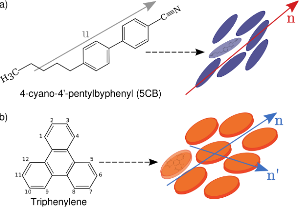
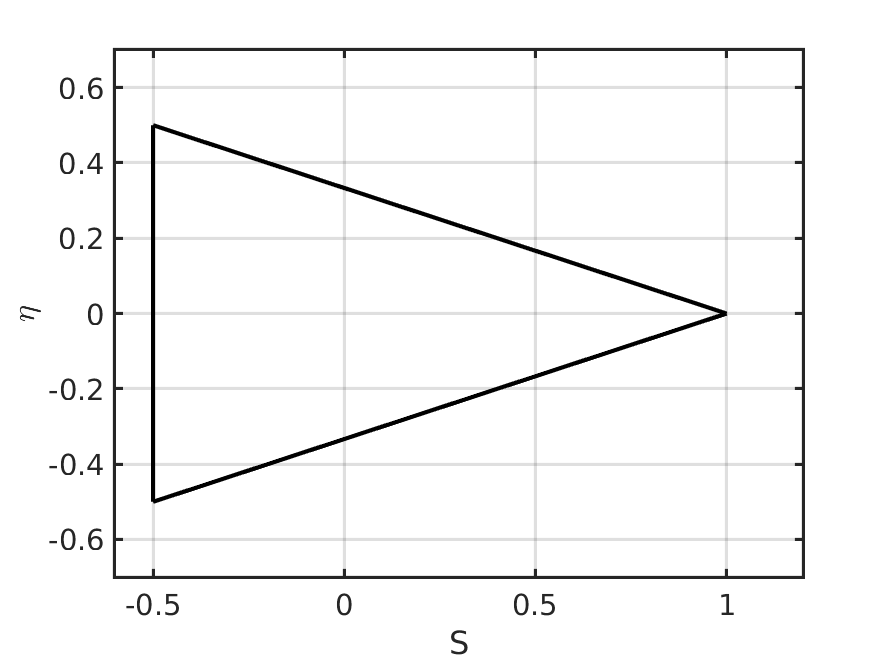
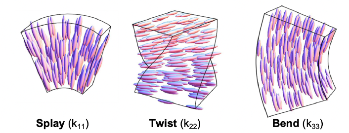
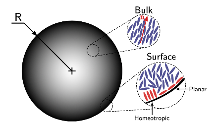

# Introduction to Liquid Crystals

In this section, we will focus on fundamental definitions for the construction of a phenomenological model that represents Liquid Crystals accurately.

# Order parameters
We describe the system using the $\mathbf{Q}$ tensor order parameter, and we use the Landau-de Gennes free energy functional to describe the energetics of the system.

A tensorial representation of the molecular order is required in order to describe regions of molecular mismatch a.k.a. defects. A schematic for two popular molecules is:



Here, the individual molecular orientation is represented by the vector $\mathbf{u}$, for the 5CB molecule, and the director fields, $\mathbf{n}$ and $\mathbf{n'}$, are the average molecular orientations of the ensemble. Because defects are regions where the director field diverges, we resort to using the $\mathbf{Q}$ tensor as a continuous descriptor of molecular oder, as defined by:
```math
\mathbf{Q}=S\left(\mathbf{nn}-\frac{\mathbf{\delta}}{3} \right) + \eta\left[ \mathbf{n'n'}-\left(\mathbf{n\times n'}\right)\left(\mathbf{n\times n'}\right)\right]
```
After diagonalization, the first eigenvalue of $\mathbf{Q}$ is the order parameter, and the corresponding eigenvector is the director field.
```math
\mathbf{Q}= \left( \begin{matrix} \frac{2}{3}S  &  & \\
  & \eta -\frac{1}{3}S & \\
  & & -\eta-\frac{1}{3}S
  \end{matrix}\right)
```
The order parameters are bounded by:
```math
-\frac{1}{2}\leq S \leq 1 \\
-\frac{1}{3}\left(1-S\right)\leq\eta \leq \frac{1}{3}\left(1-S\right) \\
\mathrm{tr}\left(\mathbf{Q}^2\right)<\frac{2}{3}
```
which forms a bounded space:



An alternative representation of the $\mathbf{Q}$ tensor uses a projection onto an orthonormal tensor basis $\mathbf{T}$ that is equivalent but allows an unbiased sampling of the tensorial order field. The mapping is defined by:
```math
\mathbf{Q}=\sum_{\nu=1}^{5} a_{\nu}\left(\mathbf{x}\right)\mathbf{T}^{\nu}
```
where the five scalar components $a_{\nu}$ are projections. The basis are defined by,
```math
\mathbf{T}^1=\sqrt{\frac{3}{2}}\left[\mathbf{zz}\right]^{ST}, \quad \mathbf{T}^2=\sqrt{2}\left[\mathbf{xy}\right]^{ST}, \\
\mathbf{T}^3=\sqrt{2}\left[\mathbf{xz}\right]^{ST}, \quad \mathbf{T}^4=\sqrt{\frac{1}{2}}\left(\mathbf{xx-yy}\right), \qquad \mathbf{T}^5=\sqrt{2}\left[\mathbf{yz}\right]^{ST}.
```
Where $\left[\cdot\right]^{ST}$ is the symmteric-traceless projection operator and x, y, and z are the vectors in the canonical basis. In order to map from $\mathbf{Q}$ components to the $a$ coefficients,

```math
Q_{11}=-\frac{a_1}{\sqrt{6}}+\frac{a_4}{\sqrt{2}} \qquad Q_{12}=\frac{a_2}{\sqrt{2}}\\
Q_{13}=\frac{a_3}{\sqrt{2}} \qquad Q_{22}=-\frac{a_1}{\sqrt{6}}-\frac{a_4}{\sqrt{2}} \qquad Q_{23}=\frac{a_5}{\sqrt{2}}
```

# Free energy functional
Our interest is centered in representing systems under realistic conditions, which means that our model should account for phase transitions, deformations of the material, and the influence of surfaces. In order to do so, we resort to a thermodynamic description that leads to the Helmholtz free energy comprised of three contributions: a phenomenological expression to characterize the internal structure, an energetic penalty for elastic deformations, and a term responsible for imposing a preferred orientation at any interface. We express the free energy functional in terms of Q in order to obtain a description that is continuous in all points of the domain. The bulk free energy takes the form of a polynomial expression in Q, following Landau's theory of phase transitions later adapted to LCs by de Gennes \cite{deGennes1969}. Alternatives for the static description include the Maier-Saupe theory and the Onsager theory, which are simple expressions for thermotropic liquids or lyotropic systems respectively. For the non-homogeneity of nematic phases, the Oseen theory and Frank theory \cite{Frank1958} are often used to penalize for different modes of deformation. Finally, there are two types of functionals to impose a preferred orientation with respect to an interface: the Rapini--Papoular theory for homeotropic orientation or the Fournier-Galatola theory for degenerate planar orientation.

The free energy functional is written as,
```math
F\left(\mathbf{Q},\nabla\mathbf{Q}\right)=\int\mathrm{d^3}\mathbf{x}\left[f_{L}(\mathbf{Q})+f_{E}(\mathbf{Q},\nabla\mathbf{Q})\right]+\oint\mathrm{d^2}\mathbf{x}f_{S}(\mathbf{Q}),
```
where $f_L$ is the Landau--de Gennes free energy, $f_E$ is the elastic free energy, and $f_S$ is the surface free energy. 

The Landau--de Gennes free energy is a phenomenological expression that predicts a phase transition between the isotropic and nematic phases, and is written as a truncated power series in terms of the invariants of the order parameter $\mathbf{Q}$
```math
f_{L}(\mathbf{Q})=\frac{1}{2}A\left(1-\frac{U}{3}\right)\mathrm{tr}(\mathbf{Q}^2) - \frac{1}{3}AU\mathrm{tr}(\mathbf{Q}^3) + \frac{1}{4}AU\mathrm{tr}(\mathbf{Q}^2)^2,
```
where $A$ is a coefficient that sets the energetic scale of the system, and $U$ is a dimension-less thermal parameter that bounds the equilibrium scalar order parameter $S$.

The elastic free energy is built as an analogy to solid elasticity. States with higher free energy present spatial distortions of the molecular orientations, these are spatial inhomogeneities of the order field. The Frank-Oseen theory considers that any deformation can be decomposed into three independent modes: splay, twist, and bend, represented in three elastic non-vanishing moduli $k_{11}, k_{22}, k_{33}$.



The complete elastic free energy for the uniaxial case includes the three main deformation modes, a saddle-splay mode for spatial distortion due to curved interfaces or inhomogeneous boundary conditions, and a penalty for the inherent twist of cholesteric materials. The functional can be written in terms of $\mathbf{Q}$ and $\nabla{\mathbf{Q}}$.
```math
f_{E}=\frac{L_1}{2}\frac{\partial Q_{ij}}{\partial x_k}\frac{\partial Q_{ij}}{\partial x_k}+\frac{L_2}{2}\frac{\partial Q_{jk}}{\partial x_k}\frac{\partial Q_{jl}}{\partial x_l}+\frac{L_3}{2}Q_{ij}\frac{\partial Q_{kl}}{\partial x_i}\frac{\partial Q_{kl}}{\partial x_j}+\frac{L_4}{2}\frac{\partial Q_{jk}}{\partial x_l}\frac{\partial Q_{jl}}{\partial x_k}+\frac{L_4}{2}\frac{\partial Q_{jk}}{\partial x_l}\frac{\partial Q_{jl}}{\partial x_k}+\frac{L_5}{2}\epsilon_{ikl} Q_{ij} \frac{\partial Q_{lj}}{\partial x_k},
```
with the three main elastic constants related to the elastic moduli by,
```math
L_1=\frac{1}{6S^2}\left(k_{33}-k_{11}+3k_{22}\right), \quad L_2=\frac{1}{S^2}\left(k_{11}-k_{22}\right), \quad L_3=\frac{1}{2S^2}\left(k_{33}-k_{11}\right)\\
L_4 = \frac{1}{S^2}k_{24}, \quad L_5 = \frac{2}{S^2}q_0 k_{22}.
```

Here, $S$ is the equilibrium order parameter given by the thermal parameter from the Landau--de Gennes theory. Measurements for the saddle-splay moduli are difficult to obtain since this type of deformation is visible in submicron confinement conditions, which also induces other combined elastic effects. Cholesteric liquid crystals show an inherent twist deformation caused by the enantiomeric character of the molecules. The director field follows a helical fashion and completes one revolution in a distance $p_0$ known as the pitch. The $L_5$ constant is thus related to the twist moduli and the chirality of the system $q_0=2\pi/p_0$.

Finally, the chemical affinity between the LC molecules and any foreign agent, such as a confining wall or a colloid, dictates the preferred orientation at the interface. The surface free energy functional is written as a combination of two cases: homeotropic and planar degenerate alignment, to impose an inclination  with respect to the contact surface,



```math
f_{S}(\mathbf{Q})=\cos\left(\theta_s\right) \left[\frac{1}{2}W_{\perp}\left(\mathbf{Q-Q^o}\right)^2\right]+\sin\left(\theta_s\right)\left[\frac{W_{\parallel}}{2}\left(\mathbf{\bar{Q}-\bar{Q}_{\perp}}\right)^2+\frac{W_{\parallel}}{4}\left(\mathbf{\bar{Q}:\bar{Q}}-S^2\right)^2\right],
```
where the $W$ coefficients are the anchoring strengths, $\theta_s$ is the preferred orientation with respect to the normal of the surface, $\mathbf{Q}^o$ is the preferred orientation at the surface, and the following are projections used for the planar degenerate alignment: $\bar{\mathbf{Q}} = \mathbf{Q} + S\bm{\delta}/3$, $\bar{\mathbf{Q}}_{\perp} = \mathbf{p\bar{Q}p}$, $\mathbf{p} = \bm{\delta} - \bm{\nu\nu}$, and $\bm{\nu}$ is the unit vector normal to the surface.

With this definition of the free energy functional, we are able to study systems from a fundamental perspective, as well as for experimental applications purposes. The main objective of using a $\mathbf{Q}$ formulation is being able to describe any defect structure, which by definition are regions where molecular orientations diverge and have a biaxial character. Defect structures are of main interest because they can be harnessed for optical applications, directed assembly, or as templates for imprinting order. The validity of this functional is for uniaxial nematic phases, by construction of the bulk contributions, however, this still leaves us with an ample field of applicability. A stable thermodynamic state is obtained for configurations that minimize the free energy functional $F(\mathbf{Q})$. In order to find stable thermodynamic states, we resort to minimization techniques defined within a numerical framework.